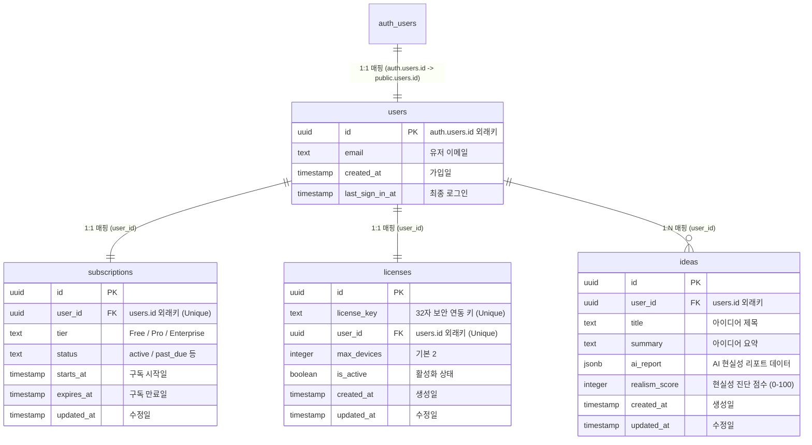

# Supabase 데이터베이스 인프라 구축 및 셋업 가이드

이 문서는 글로벌 창업 현실성 진단 플랫폼 **Limina**의 데이터베이스를 Supabase 클라우드에 구성하기 위한 매뉴얼입니다.

---

## 📊 데이터베이스 테이블 구조 관계도 (ERD)

---

## 🛠️ Supabase 프로젝트 생성 및 초기 세팅 경로

### 1단계. Supabase 프로젝트 생성
1. 웹 브라우저를 열고 [supabase.com](https://supabase.com)에 로그인합니다.
2. 메인 대시보드 화면 중앙 또는 우측 상단의 **`New project`** 초록색 버튼을 클릭합니다.
3. 프로젝트 생성 화면이 나타나면 아래 세부 양식을 입력합니다:
   - **`Organization`**: 프로젝트가 소속될 조직을 선택합니다.
   - **`Name`**: `Limina`를 입력합니다.
   - **`Database Password`**: 안전한 비밀번호를 생성하여 입력하고, 반드시 따로 기록해 둡니다.
   - **`Region`**: 전 세계 배포 및 지연 속도 최적화를 위해 **`Seoul (ap-northeast-2)`**을 선택합니다.
   - **`Pricing Plan`**: 개발용 혹은 로컬 가동 테스트용으로 **`Free`** 플랜을 선택합니다.
4. 하단의 **`Create new project`** 버튼을 클릭하여 데이터베이스 인프라 생성을 시작합니다. (생성에는 약 1~2분이 소요됩니다.)

---

## 💾 SQL Editor를 활용한 인프라 빌드 경로

### 2단계. 스키마 및 트리거 이식
1. 프로젝트가 정상 생성되면, 좌측 사이드바 메뉴에서 번개 표시 아래에 있는 **`SQL Editor`** (종이와 연필 아이콘) 메뉴를 클릭합니다.
2. SQL Editor 화면 상단에서 **`+ New query`** (또는 `Create a new query`) 버튼을 클릭하여 비어 있는 쿼리 편집 창을 엽니다.
3. 프로젝트 내 [docs/schema.sql](file:///c:/dev/Limina/docs/schema.sql) 파일에 담긴 모든 SQL 쿼리를 전체 복사(`Ctrl+A` -> `Ctrl+C`)하여 Supabase 편집기에 붙여넣기(`Ctrl+V`)합니다.
4. 편집기 우측 하단의 **`Run`** (또는 단축키 `Ctrl+Enter`) 버튼을 클릭합니다.
5. 실행 결과 창에 **`Success. No rows returned`** 메시지가 나타나면 4대 핵심 테이블(users, subscriptions, licenses, ideas)과 RLS 보안 필터, 시간 자동 갱신 트리거 및 가입 자동 매핑 트리거가 모두 연동된 것입니다.

---

## 🛡️ 철통 행 단위 보안 정책 (RLS) 검증 경로

### 3단계. RLS 정상 켜짐 확인
1. 좌측 사이드바 메뉴에서 열쇠 모양 아이콘인 **`Database`** 메뉴를 클릭합니다.
2. 세부 메뉴 중 **`Table Editor`** 또는 **`Database` -> `Tables`**를 클릭합니다.
3. 각 테이블(`users`, `subscriptions`, `licenses`, `ideas`) 명칭 우측의 **`RLS`** 열에 초록색 자물쇠 아이콘과 함께 **`Active`** 표시가 켜져 있는지 확인합니다. (비활성화 상태라면 `schema.sql`이 덜 실행된 것이니 다시 확인해 주세요.)
4. 이를 통해 타인이 API 또는 익스텐션을 해킹하여 다른 회원의 아이디어나 인증 라이선스 키를 탈취해 조회/수정하는 것이 완벽하게 방어됩니다.

---

## ⚡ Realtime (실시간 알림) 활성화 설정 경로

데스크톱 에이전트와 웹 대시보드 간의 실시간 연동(아이디어 진단 완료 알림 등)을 작동시키기 위해 `ideas` 테이블의 Realtime 기능을 수동으로 활성화해야 합니다.

### 4단계. ideas 테이블 Realtime 켜기
1. Supabase 대시보드 좌측 사이드바 메뉴에서 톱니바퀴 아이콘인 **`Project Settings`** 메뉴를 클릭합니다.
2. 세부 메뉴 중 **`Database`**를 클릭합니다.
3. 아래로 조금 스크롤하여 **`Publications`** 영역을 찾습니다.
4. **`supabase_realtime`** 항목의 우측에 있는 **`Edit`** (또는 활성화 버튼)을 클릭합니다.
5. 활성화 팝업창에서 **`ideas`** 테이블의 체크박스를 찾아서 체크(활성화)해 줍니다.
6. **`Save`** 또는 **`Update publication`**을 눌러 설정을 저장합니다.
